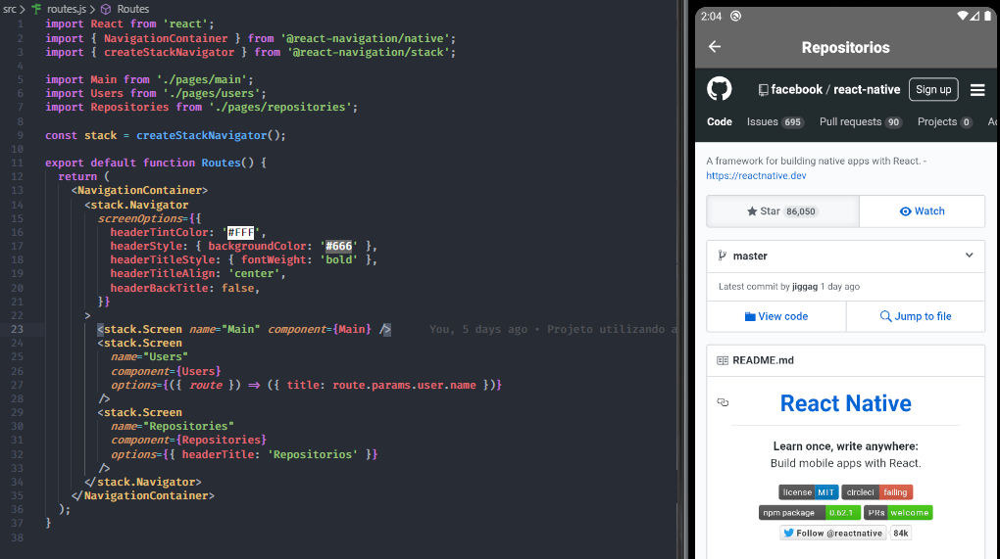

## **Primeira aplicação**
  Desenvolvida com React native utilizando React Navigation 5, consumindo API do github para fazer
  pesquisas de usuários e visualizando as stars curtidas.
  
### Para utilizar esse projeto 
  Utilizar comando para instalar react-native-cli, também necessário ter um emulador de Android ou Ios, serve sendoe o próprio device para visualizar projeto.
  ```bash
    yarn global add react-native-cli
  ```

### Instalação e Utilização do projeto.

```bash

    # Clone this repository
    `$ git clone https://github.com/Carlos-Reiss/search-in-github.git`

    # Go into the repository
    $ cd search-in-github

    # Install dependencies
    $ yarn install ou npm install

    # Running in simulator open
    $ react-native run-android ou react-native run-ios

```

Resultado:


